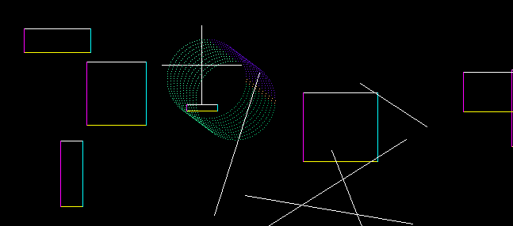

# render

Test project that I'm using to learn how to directly draw pixels in a window.  No GPU, no graphics libraries.  Microsoft Windows.

This program accomplishes a "direct drawing" functionality by using an in-memory bitmap.  The bitmap contains one `uint32` to represent every pixel in the window.  In Windows, colors are represented as `uint32` - red, green, and blue are one byte each.  A fourth, dummy byte is used to align to 32 bits.  To change the color of a pixel, simply change the value of that `uint32` in the bitmap.  When all of the pixels have been filled in with the desired colors, call back to Windows (`StretchDIBits`) to display the bitmap on the screen.

This program runs at a fixed framerate.  Each frame, user input is processed, every pixel in the bitmap is filled in (background first, foreground shapes second), and the bitmap is sent to the window.

`Win32` is the Microsoft Windows platform layer.  It handles the particulars of creating a window, capturing user input, and displaying the bitmap image.

`Render` is the core logic.  It checks the user inputs and updates the bitmap.  It contains all of the drawing algorithms.  It also contains the (arbitrary) example code for generating different backgrounds and shapes to display.

`Render` is unaware of the Windows-specific behavior that `Win32` is handling.  `Win32` calls `Render::update` every frame to pass the updated inputs and get a new bitmap.  It is not necessary for `Render` to know anything about the Windows platform.

`Render` creates and manages a few types of geometry:  lines, rectangles, and circles.  The lines are stored as two points.  During each frame, a linear interpolation is performed to draw the pixels in between the two points.  Rectangles are stored as four points.  After being converted into four lines, the rectangle edges go through the same linear interpolation.  Each edge of the rectangle is a different color just for variety.  The circles are stored as a position and a radius.  The circles are drawn with only ten points along the edge of the circle.  Increasing this to 100 makes a much more complete-looking circle with no noticeable performance impact, but the "dotted outline" of the ten-point circle is interesting to look at!

Each frame, `Render` checks user input to see if the image should be modified.  Depending on the type of input, the shapes can be panned or rotated.  Other inputs toggle between different backgrounds.

### Controls

- Middle Mouse Button click and drag to pan
- Q or Left Mouse Button to rotate clockwise
- E or Right Mouse Button to rotate counterclockwise
- R to generate new random rectangles and lines
- G (hold) for grid
- 1 for solid background (Mouse Wheel Scroll to adjust shade)
- 2 for blue-to-green gradient tile background
- 3 for black-to-red/green/blue gradient "bar" background

### Examples

[panning](https://user-images.githubusercontent.com/74131405/181424883-54e86065-2d5a-4d28-9d0c-32133fd65443.webm)

[rotating](https://user-images.githubusercontent.com/74131405/181425109-8302066f-f920-4fb8-8c05-2db17c44e52d.webm)

[generating new shapes](https://user-images.githubusercontent.com/74131405/181425135-179915df-c27b-479b-a6ff-a3bf83a879a2.webm)

[various backgrounds](https://user-images.githubusercontent.com/74131405/181425145-fd58f87e-ed13-427b-a702-9b40ce49266e.webm)

### Notes

- This was written on Windows.  For this to work as is, you will need to have MSVC compiler and linker (`cl.exe` and `link.exe`).  I run `...\Visual Studio\VC\Auxiliary\Build\vcvarsall.bat x64` to set up my environment.  See `tools/build*.bat` for the build commands.
- This avoids using the GPU and graphics rendering libraries only because I'm using it as a learning experience.  And I don't really mind not needing to debug my mediocre GLSL code!

